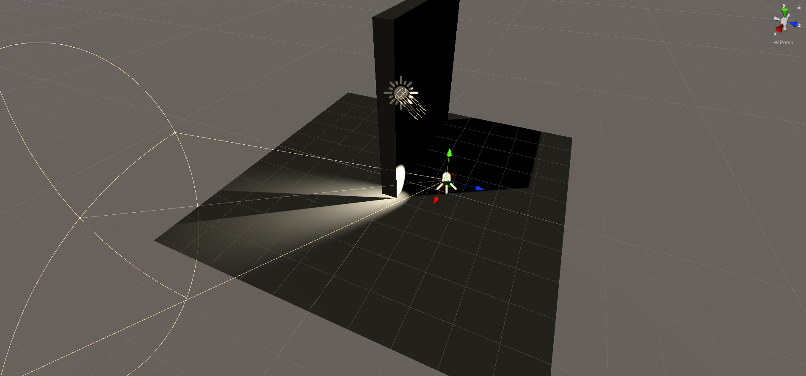
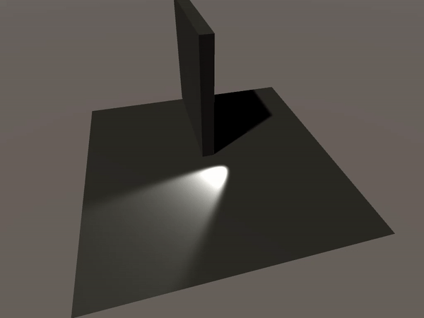
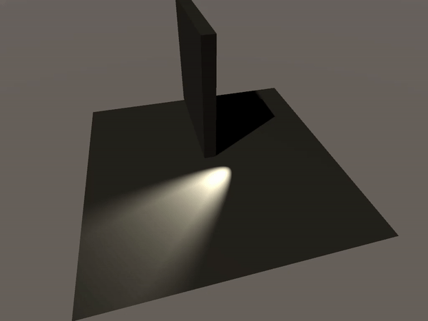
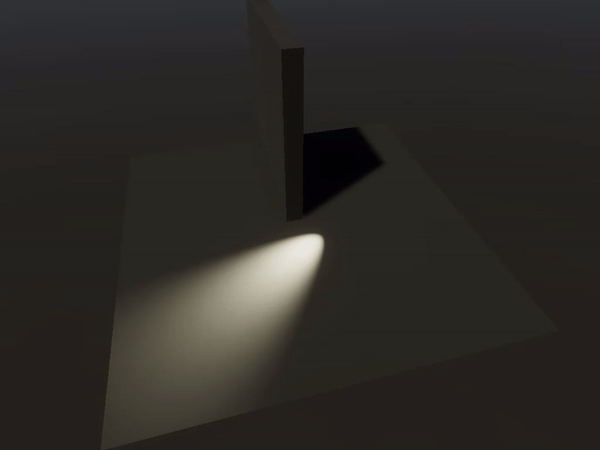

# Context

We're using Unity 2019.4 for this demonstration as it is the current LTS version for Unity. The problem described here also happens in Unity 2020.1 using the same setup.

This problem emerged while we were trying to make a simple prototype of a 3rd person game with a top-down'ish camera, where the controllable character has a flashlight. We decided to go with a realtime spotlight to make this flashlight as it seemed other approaches (baked illumination) would be detrimental to the look we wanted for the game.

# The Setup

For each of the pipelines (URP, HDRP and Built-in), a default project for that pipeline was created from Unity Hub's launcher. On a new scene, we added Unity's default plane and cube 3D objects, a directional light for minimal fill-light, and a spotlight, pointed towards the wall:

# The problem

When the wall is animated, both in URP and Built-in pipelines, the spotlight is able to go through the middle of the wall.

Built-in pipeline:

URP:

# HDRP does not show the same issue

HDRP seems to calculate shadowmaps every frame when a light is marked to do so. Either this or the ShadowCaster portion of the HDRP shaders seem to prevent the issue that happens in URP and Built-in, but this is just a suspicion, as it is very difficult to debug this.

# Final Considerations

We're not sure what causes this issue to happen in both Built-in and URP and not happen in HDRP. Though adopting HDRP would fix this issue for us, it makes the person-hour cost of making materials and effects much larger, and prevents us from developing for lower-end PCs and Nintendo Switch (which HDRP doesn't support yet).

Any suggestions for solving or understanding this issue is welcome.